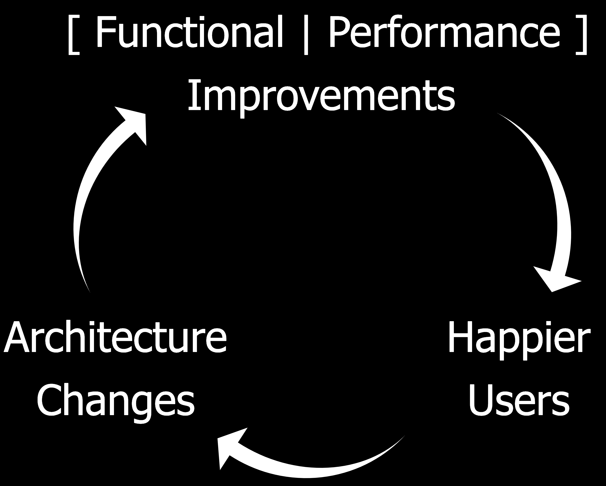
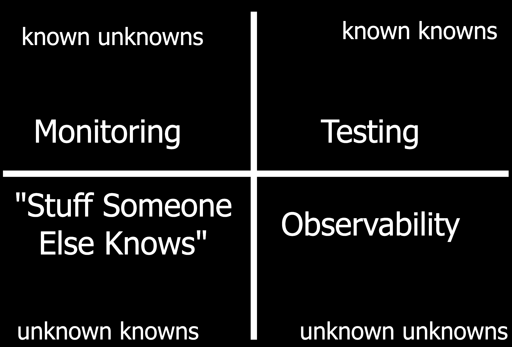
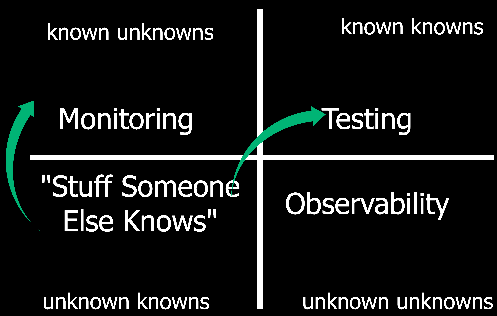

## What's Fitness Function-Driven Development for Operability?

Monitorama Baltimore | October 21, 2019

---

#### Evolutionary Architecture

---

### Operability

> is the ability to keep a system in secure and reliable functioning condition

---

### It's a quality to aim for across teams.

Security

Compliance

"Operations"

Development

Infrastructure

Platform

Finance

---

### Architecture changes often lead to operational changes.

Container architecture => vulnerability management

Microservices => observability

GDPR => data inventory reporting

Continuous Delivery => No more change advisory boards?

---

### A Fitness Function

> is a particular type of objective function that is used to
> summarize __how close__ a given design solution is to achieving the set aims.

<small>"Building Evolutionary Architectures" by Neal Ford, Rebecca Parsons, & Patrick Kua</small>

---

---

---

### Fitness Function-Driven Development

> introduces continuous feedback for architectural conformance and
> inform the development process as it happens, rather than after the fact.

<small>[Fitness Function-Driven Development](https://www.thoughtworks.com/insights/articles/fitness-function-driven-development) by Rosemary Wang & Paula Paul</small>

---

### Let's try this.

Security ❤️

---

### What did we like about it?

- KonMari method for former assumptions, tools, and telemetry
- Highlight gaps in process, tooling, and telemetry
- Relate technical decisioning to business value
- Organize stakeholder aims

---

### What would we improve?

- Try not to over-optimize
- Balance implemention with review from stakeholders

---

## What changed in our architecture that affects how effectively we operate?

---

## Thank you!

Rosemary Wang

she/her

@joatmon08

Developer Advocate, HashiCorp